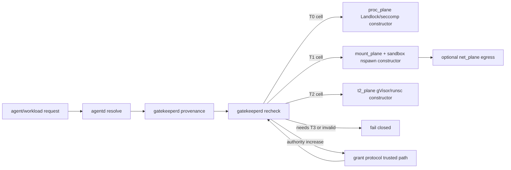

# Shrek OS — overview

> Shrek OS is an OS substrate for running semi-trusted agents where semantic authority is bounded by data authority.

Shrek OS is an immutable Linux system and control plane for executing semantic agents, tools, and ordinary workloads under explicit capability boundaries. Its core security claim is not that agents behave well; it is that the system gives them no more authority than their sealed profile and live grants allow. If a subject cannot read a byte through the deterministic filesystem wall, it also cannot discover, index, embed, summarize, relate, or export that byte through the semantic filesystem.

## 1. Problem

Modern agent workflows need broad context: source trees, build tools, project history, documents, terminals, search indexes, and network access. Traditional desktop operating systems have weak answers for that shape. They mostly grant a process a user account, then rely on application restraint, prompts, or after-the-fact auditing.

That is the wrong boundary. The operating system must separate:

```
blast wall     = how hard the workload is boxed
blast radius   = what the workload can reach inside that box
semantic view  = what the workload can learn through indexes and summaries
```

Shrek's invariant is:

```
semantic authority <= data authority
```

The filesystem stays ground truth. The semantic layer may make the machine easier to understand, but it must never become a side channel around the file wall. This is specified in [`security-model.md`](security-model.md) §1 and carried into the filesystem intelligence design in [`filesystem-intelligence.md`](filesystem-intelligence.md) / [`swamp.md`](swamp.md).

## 2. Design goals

- **Deterministic authority.** Access decisions compile to kernel or broker-enforced primitives: Landlock, seccomp, namespaces, cgroups, bind mounts, nftables, dm-verity, and signed policy.
- **Two independent checks.** `agentd` resolves identity/profile/tier, but `gatekeeperd` independently re-checks before constructing a sandbox. See [`agents.md`](agents.md) §5 and [`isolation.md`](isolation.md) §7.
- **Semantics after authorization.** `swampd` and search workers authorize before retrieval. They never global-search then filter secrets after the fact.
- **Immutable base, composable layers.** The base is sealed with dm-verity; optional system capabilities arrive as signed sysext/confext Onion layers. See [`phase2-onion.md`](phase2-onion.md) and [`phase4-oniond.md`](phase4-oniond.md).
- **Human grants through a trusted path.** Authority-increasing grants go through the grant protocol and are applied by the broker. Agents receive no bearer token to steal or replay. See [`grant-protocol.md`](grant-protocol.md).
- **Availability and authority are separate planes.** A missing semantic stack may degrade search; it must not widen agent execution. See [`architecture.md`](architecture.md) §9.

## 3. Non-goals

- **Not a from-scratch distro.** Debian supplies packages; `mkosi` builds the image. LFS is a frozen research reference, not the product base.
- **Not a package manager replacement.** Onion layers use `systemd-sysext`/`systemd-confext`; Shrek orchestrates policy and trust, not low-level layering.
- **Not an unconfined native-app desktop.** Signed native code may get a lower trust floor, but it still runs under a capability profile.
- **Not a classifier wall.** Semantic DLP is advisory. Catastrophic data must be behind deterministic denial before any classifier runs.
- **Not a prompt discipline.** The wall does not depend on agent instructions. Untrusted content is treated as data, not instruction; the tripwire posture is specified in [`agents.md`](agents.md) §8 and [`security-model.md`](security-model.md) §8b.

## 4. Core novelty

### Agent-capability model

An agent is an attested subject with a sealed capability profile and a trust band:

```
agent := (identity, profile, trust_band)
effective authority = sealed profile ∩ live grants
```

The profile describes the blast radius: paths, commands, search scope, export, and egress. The trust band describes the blast wall: T0 through T3. These are orthogonal. A stronger wall never widens the radius, and narrow caps never lower the trust floor. The tier matrix is implemented in [`crates/shrek-policy/src/tier.rs`](../crates/shrek-policy/src/tier.rs). The broker derives trust-band evidence in [`crates/gatekeeperd/src/provenance_plane.rs`](../crates/gatekeeperd/src/provenance_plane.rs) instead of trusting the caller's label.

### Semantic filesystem security invariant

`swampd` is itself a subject of policy. It is default-deny Landlocked to an explicit indexable allow-set, so protected bytes never enter its address space. Query projection is caller-scoped, so an agent's semantic view is no broader than its data view. See [`architecture.md`](architecture.md) §5, [`swamp.md`](swamp.md) §5/§9, and [`security-model.md`](security-model.md) §5.

### Trust bands and constructors

The design tiers are:

| Tier | Constructor | Current state |
|---|---|---|
| T0 | Landlock + seccomp + user/mount/pid/net/uts/ipc/cgroup namespaces + cgroups v2; no rootfs | shipped for the T0 matrix cells in Phase-5 slice 4 |
| T1 | `systemd-nspawn` with synthetic root, read-only grant binds, private users, private network | shipped for mount and egress slices |
| T2 | gVisor `runsc` userspace kernel with sealed runtime artifacts | shipped for no-network T2 cells in Phase-5 slice 6 |
| T3 | libkrun/Firecracker/Kata microVM, with virtio-fs-style file passing | designed; constructor deferred |

The matrix and floor are the design-of-record in [`isolation.md`](isolation.md) §5 and the executable policy in [`crates/shrek-policy/src/tier.rs`](../crates/shrek-policy/src/tier.rs). Constructor details are in [`phase5-slice1-mount.md`](phase5-slice1-mount.md), [`phase5-slice2-tier.md`](phase5-slice2-tier.md), [`phase5-slice4-t0.md`](phase5-slice4-t0.md), and [`phase5-slice6-t2.md`](phase5-slice6-t2.md).

### Gatekeeper broker and two-plane grant architecture

`gatekeeperd` is the privileged wall. It brokers layer merges and sandbox construction, re-reading sealed policy and refusing requests below the required tier or outside the granted profile. `agentd` is the unprivileged resolver. The grant protocol adds the human approval plane on top of that broker: `agentd` submits a proposal, `gatekeeperd` pre-checks the invariant, the trusted surface gets a human decision, and `gatekeeperd` applies the result directly.

The current broker skeleton is in [`crates/gatekeeperd/src/main.rs`](../crates/gatekeeperd/src/main.rs). The sandbox constructor path is in [`crates/gatekeeperd/src/sandbox.rs`](../crates/gatekeeperd/src/sandbox.rs). The grant protocol is specified in [`grant-protocol.md`](grant-protocol.md); the mutable grant machinery is not shipped yet.

### The Onion

The Onion is Shrek's system-layer mechanism: signed dm-verity DDI sysext/confext images on an untrusted store, selected by sealed policy, exposed through broker-controlled search directories, and merged by systemd under a fixed image policy. Shrek does not implement overlay mechanics. Phase 2 proved signed merge and refusal; Phase 4 moved selection into `oniond`, then moved privileged merge into `gatekeeperd`.

Sources: [`phase2-onion.md`](phase2-onion.md), [`phase4-oniond.md`](phase4-oniond.md), [`phase4-gatekeeperd.md`](phase4-gatekeeperd.md), [`crates/gatekeeperd/src/main.rs`](../crates/gatekeeperd/src/main.rs).

### Integrity chain

The shipped spike image proves:

```
UEFI Secure Boot db → signed UKI → dm-verity root → sealed /usr policy + binaries
                                          ↓
                         signed verity Onion layers
```

`systemd-sysupdate` raw A/B is the current update transport. Boot assessment rolls back broken updates for availability. Security anti-rollback for mutable policy is a separate TPM NV monotonic-counter design and is not yet implemented. See [`update-model.md`](update-model.md), [`phase1-s8-rollback.md`](phase1-s8-rollback.md), and [`security-model.md`](security-model.md) §4/§8.

### Desktop and shell layer

Shrek Shell is an optional Onion layer set, not part of the headless base. Its stable interface is a role map delivered as systemd user services: compositor, bar, launcher, notifications, portals, session/lock, and the Shrek-native policy/agent UI. The policy UI is the trusted-path role and is not a cosmetic shell component. See [`shell-architecture.md`](shell-architecture.md) and [`grant-protocol.md`](grant-protocol.md).

## 5. Current build state

Shipped and VM-proven:

- Phase 0 docs are complete.
- Phase 1 sealed Debian image boots under enforcing Secure Boot and dm-verity.
- Phase 1 S7/S8 `systemd-sysupdate` A/B update and automatic rollback are proven.
- Phase 2 signed Onion layers merge; unsigned/tampered layers are refused.
- Phase 4 slice 1/2: `oniond` owns selection and `gatekeeperd` privilege-separates the merge.
- Phase 5 slice 1: T1 mount plane with pin→verify→relocate and synthetic root.
- Phase 5 slice 2: compiled trust×caps decision plane and independent broker recheck.
- Phase 5 slice 3: T1 egress plane with private netns, sealed egress profiles, nftables allow-list, and fail-closed setup.
- Phase 5 slice 4: genuine T0 Landlock process sandbox for the T0 matrix cells.
- Phase 5 slice 6: T2 gVisor constructor with sealed `runsc` and rootfs artifacts.
- Phase 5 slice 7: trust-band provenance; `gatekeeperd` derives the band from sealed evidence instead of trusting caller input.
- Phase 5 slice 8: sealed static pin-manifest classification for `T-pinned` (fs-verity digest vs baked manifest).
- Phase 5 slice 9: `T-pinned` static-PIE execution from an exact-inode T0 **exec island**.
- Phase 5 slice 10: `T-pinned` dynamically-linked execution from an authenticated N-inode **closure island** (entrypoint + `PT_INTERP` + transitive `DT_NEEDED`).
- Phase 5 consolidation: pin-verity fixture surface compiled out of production (F1); exec-island root sealed `MS_NOEXEC` with a fail-closed self-check (F2). The **§11 execution contract** in [`security-model.md`](security-model.md) states the resulting guarantees and non-guarantees.

Deferred by design, not bugs:

- T0 write realization for `C-proj-rw`; both T0 and T1 are read-only today.
- T0 subuid privilege drop; slice 4 maps container-root to real root and relies on Landlock/seccomp as the wall.
- T0 clone/clone3 argument filtering for user-namespace creation.
- T2 egress for `C-net`; current T2 is no-network only.
- T3 microVM constructor.
- `dlopen`/runtime closure extension for a pinned dynamic workload (v1 authenticates the build-enumerated closure only).
- `≥T1` containment of a pinned artifact (`floor(Pinned)=T0` today).
- Persistent mutable grants with TPM NV-counter-backed manifests.
- Grant UI implementation and graphical trusted overlay.
- Pre-ship removal of spike gate scripts/units named in the slice docs.

The roadmap's current-state summary is [`roadmap.md`](roadmap.md). The precise as-built guarantees/non-guarantees are [`security-model.md`](security-model.md) §11; mechanism/evidence records are [`phase5-slice4-t0.md`](phase5-slice4-t0.md), [`phase5-slice6-t2.md`](phase5-slice6-t2.md), [`phase5-slice7-trust-provenance.md`](phase5-slice7-trust-provenance.md), [`phase5-slice8-pin-manifest.md`](phase5-slice8-pin-manifest.md), [`phase5-slice9-pin-exec-home.md`](phase5-slice9-pin-exec-home.md), and [`phase5-slice10-sealed-dynamic.md`](phase5-slice10-sealed-dynamic.md).

## 6. Request flow



Concrete code seams:

- `crates/agentd/src/main.rs`: `agentd resolve`, profile ceiling check, tier resolution.
- `crates/shrek-policy/src/tier.rs`: matrix, floor, fail-high parsing.
- `crates/shrek-policy/src/egress.rs`: sealed named egress profiles.
- `crates/shrek-policy/src/provenance.rs`: trust-band evidence lattice.
- `crates/gatekeeperd/src/provenance_plane.rs`: sealed-root and pin-manifest evidence collection.
- `crates/gatekeeperd/src/sandbox.rs`: broker recheck and dispatch to constructors.
- `crates/gatekeeperd/src/mount_plane.rs`: fd pinning and read-only relocation for T1 grants.
- `crates/gatekeeperd/src/net_plane.rs`: T1 netns/veth/nftables egress plane.
- `crates/gatekeeperd/src/proc_plane.rs`: T0 Landlock/seccomp constructor.
- `crates/gatekeeperd/src/t2_plane.rs`: T2 gVisor constructor.

## 7. Where to read next

- Architecture: [`architecture.md`](architecture.md)
- Concept-to-code crosswalk: [`concept-to-code.md`](concept-to-code.md)
- Security model: [`security-model.md`](security-model.md)
- Agents: [`agents.md`](agents.md)
- Isolation and trust bands: [`isolation.md`](isolation.md), [`trust-bands.md`](trust-bands.md)
- Onion: [`phase2-onion.md`](phase2-onion.md), [`phase4-oniond.md`](phase4-oniond.md), [`phase4-gatekeeperd.md`](phase4-gatekeeperd.md)
- Current roadmap: [`roadmap.md`](roadmap.md)
